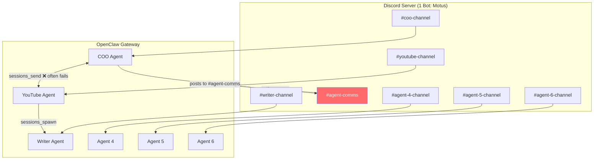
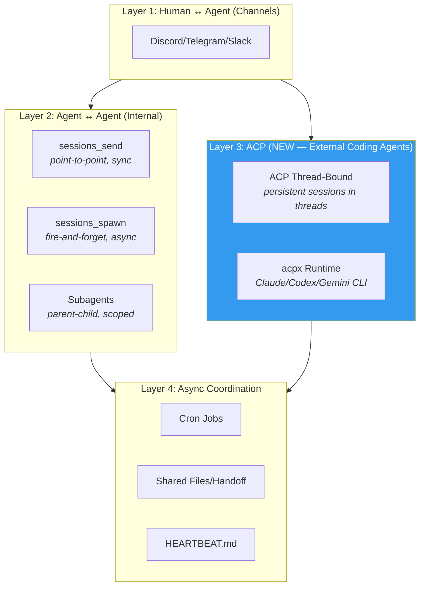
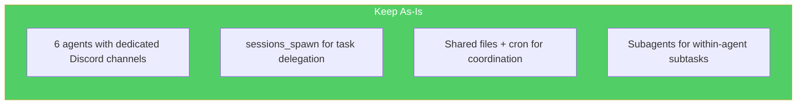
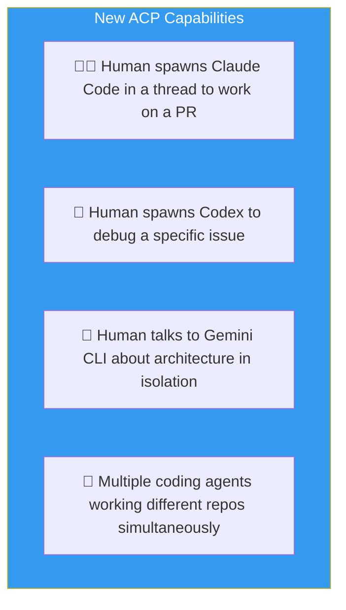

# How ACP Fits Into Your Multi-Agent Architecture

## Your Current Setup



### Known Pain Points

| Problem | Root Cause |
|---|---|
| `sessions_send` fails | Target agent must have an **active session** — if idle, message is queued but agent never wakes |
| Comm channel posts invisible | Self-message filter drops all messages from the shared bot |
| Manual session activation | After `sessions_send`, you must manually chat to trigger the receiving agent |
| Subagent context loss | Spawned subagents run in isolated sessions, can't easily coordinate back |

---

## The OpenClaw Coordination Layer (Big Picture)



**ACP is a NEW Layer 3** — it doesn't replace layers 1, 2, or 4. It adds a new capability: spawning **external coding agent CLIs** into Discord threads with proper lifecycle management.

---

## Where ACP Helps vs. Where It Doesn't

### ✅ ACP Solves These Problems

| Your Problem | How ACP Solves It |
|---|---|
| **Need a coding agent for a specific repo** | `/acp spawn codex --cwd /my/repo --thread auto` — dedicated thread with persistent session |
| **Agent output floods main channel** | Each ACP session lives in its own thread, cleanly isolated |
| **Want multiple coding tools simultaneously** | Up to 8 concurrent ACP sessions, each with different agents/models |
| **Agent needs to run long tasks** | ACP sessions persist with proper `idle → running → completed` lifecycle. No session timeout issues |
| **Want to steer/cancel mid-run** | `/acp cancel`, `/acp steer`, `/acp model` — real-time control |

### ❌ ACP Does NOT Solve These Problems

| Your Problem | Why Not | What To Use Instead |
|---|---|---|
| **Agent A needs to tell Agent B something** | ACP is for Human ↔ External Agent, not OpenClaw Agent ↔ OpenClaw Agent | `sessions_spawn` (async) or shared files + cron |
| **6 agents collaborating autonomously** | ACP agents are external CLIs, not your existing OpenClaw agents | Keep current architecture |
| **Comm channel coordination** | ACP doesn't change the self-message filter | Shared files + cron pattern |
| **sessions_send failures** | ACP is orthogonal to internal agent messaging | Use `sessions_spawn` instead |

---

## Concrete Recommendation for Your Setup

### Keep These (They're Working)



### Migrate These

| Current Pattern | Problem | Migrate To |
|---|---|---|
| `sessions_send` for inter-agent tasks | Requires active session | `sessions_spawn` (always works, async) |
| #agent-comms channel posts | Self-message trap | Shared files + cron polling |
| Manual session activation | Breaks automation | Cron jobs (check every N minutes) |

### Add ACP For These New Use Cases



**Example: You working with your YouTube agent AND a Claude Code session:**

```
Discord Thread: #youtube-agent
  You → YouTube Agent: "Plan the next video on AI agents"
  YouTube Agent → responds with plan

Discord Thread: "Claude Code: implement feature X" (ACP thread)
  /acp spawn claude --cwd /my/project --thread auto
  You → "Add the new API endpoint for user profiles"
  Claude Code → streams code changes back
  /acp model anthropic/claude-opus-4-5   ← switch model mid-session
```

---

## Key Distinction

| | Your OpenClaw Agents | ACP Agents |
|---|---|---|
| **What they are** | OpenClaw agents (Pi runtime) with your custom SOUL/TOOLS/MEMORY | External CLI tools (Claude Code, Codex, Gemini CLI) |
| **Where they live** | OpenClaw gateway process | Separate OS processes via acpx |
| **How you talk** | Discord channel / sessions_send / sessions_spawn | Discord thread bound via `/acp spawn` |
| **Persistence** | Session store + memory system | ACP session with lifecycle states |
| **Collaboration** | Can spawn subagents, send messages | Isolated — no cross-agent comms |
| **Best for** | Your domain-specific agents (COO, Writer, YouTube) | On-demand coding tasks with external AI tools |

> [!TIP]
> Think of ACP agents as **contract workers** you bring in for specific coding jobs. Your 6 OpenClaw agents are your **permanent staff** with institutional knowledge (SOUL, MEMORY, skills). They serve different purposes and complement each other.

---

## Future Possibility

Once ACP matures, there's potential for your OpenClaw agents to **spawn ACP sessions programmatically** via `sessions_spawn` + ACP backend. e.g.:

```
YouTube Agent → "I need to generate a Manim animation"
  → sessions_spawn with ACP target → Claude Code session
  → Claude Code writes the Manim code
  → Result announced back to YouTube Agent's channel
```

This isn't fully wired yet in the codebase, but the architecture supports it — the `acp-spawn.ts` module already has the `SpawnAcpParams` interface ready.
