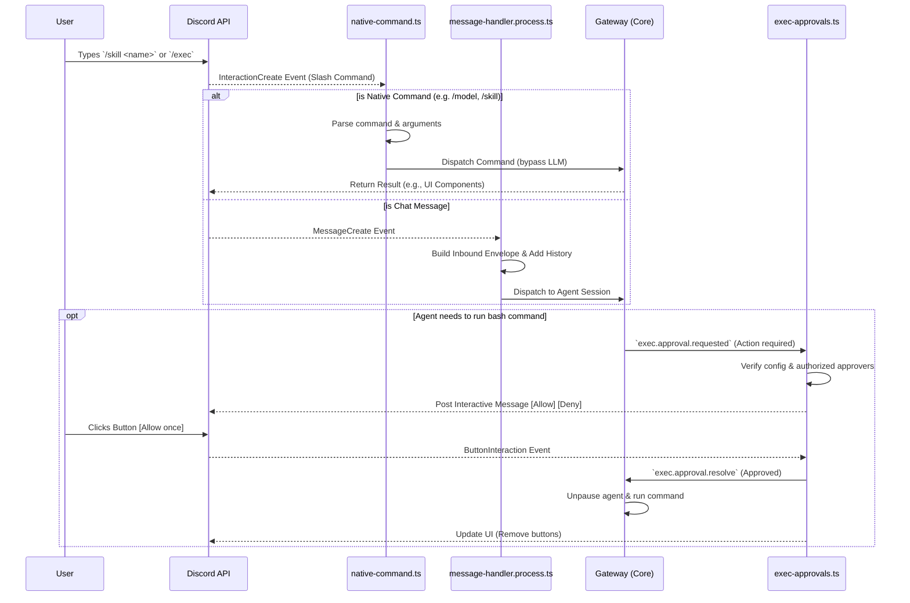

# Discord Agent Commands and Exec Approvals

## 1. Visualizing the Discord Command & Approval Flow

This diagram illustrates how OpenClaw routes incoming Discord commands, processes native slash commands, and handles execution approvals securely.



## 2. Native Commands List and How They Work

OpenClaw automatically syncs commands to Discord if `commands.native` is `"auto"` or `true`. These commands are processed immediately by the engine (`native-command.ts`) rather than being evaluated by the LLM as part of a chat conversation.

### Core Native Commands:
- `/help`: Shows command help reference.
- `/commands`: Lists available commands.
- `/status`: Shows current agent status and token quota/usage limits.
- `/allowlist [add|remove]`: Manage allowed users (requires config permissions).
- `/approve`: Resolves exec approval prompts manually if buttons fail.
- `/clear`: Clears current session history context.
- `/voice`: Discord-specific alias for TTS controls (join/leave voice channels).
- `/model <name>`: Brings up an interactive user-interface inside Discord to quickly swap the provider or model for the current thread.

### Threading & Sub-Agents:
- `/focus <target>`: Binds the current Discord thread to a specific agent session so follow-up messages automatically route to that subagent.
- `/unfocus`: Removes the thread binding.
- `/agents`: Lists the active thread-bound agents.
- `/subagents [list|kill|spawn]`: Inspect or manually spawn sub-agents.
- `/acp [spawn|close|status]`: Manage ACP (Agent Control Protocol) runtime sessions.

### Skills (`/skill`):
If a custom skill in your OpenClaw setup is flagged as `user-invocable`, OpenClaw automatically registers it as an independent top-level slash command in Discord (e.g., `/my_custom_skill <args>`). If the skill specifies `command-dispatch: tool`, OpenClaw runs the deterministic code immediately when called, completely bypassing the model cost. You can also run any skill generically using `/skill <name> <args>`.

---

## 3. Step-by-Step: Setting Up Exec-Approvals for Discord

The Exec Approval system prevents an agent from running dangerous terminal commands on your host machine without explicit human consent. OpenClaw pushes interactive buttons directly to your Discord DM or designated channel via `exec-approvals.ts`.

### Step 1: Force `ask` Mode
When chatting with your agent, make sure your session implies `ask` mode. By default, elevated commands require approval. You can verify this in chat:
- Send `/exec` in chat to see current settings.
- Ensure the output shows something like `/exec ask=always security=deny`

### Step 2: Finding Your Approver User ID
If you don't know your Discord User ID, enable **Developer Mode** in Discord (`User Settings` -> `Advanced` -> `Developer Mode`). Then right-click your own name in the chat or server user list and click **Copy User ID**. Paste that exact numeric string into the config in the next step.

### Step 3: Configure Approvers in OpenClaw
You need to specify exactly *who* is allowed to click the "Approve" buttons. Other users in the server clicking the buttons will receive an "Unauthorized" error message.

Update your `openclaw.json` (or use `/config set` if enabled) to include the `execApprovals` block:
```json5
{
  "channels": {
    "discord": {
      "execApprovals": {
        "enabled": true,
        // The numeric Discord User IDs of the people allowed to click approve
        "approvers": ["{UserID}"], 
        // Where to send the prompt: "dm", "channel", or "both"
        "target": "dm", 
        // Clean up the message after the decision is made (true/false)
        "cleanupAfterResolve": true
      }
    }
  }
}
```

### Step 4: Full Optimized Configuration Example
To prevent redundant keys (like mixing `dm.enabled` and `dmPolicy`) and to ensure numeric IDs are resolved correctly, here is a complete, optimized configuration block combining both the Channel layer and the Tools layer.

```json5
{
  "tools": {
    "exec": {
      "host": "gateway",    // Where the command runs
      "security": "allowlist", // Deny everything except safe/allowed commands
      "ask": "on-miss"      // Ask for approval if the command isn't allowlisted
    }
  },
  "channels": {
    "discord": {
      "enabled": true,
      "token": "{DiscordToken}",
      
      // Limits DMs to ONLY you (removes need for legacy dm.enabled key)
      "dmPolicy": "allowlist",
      "allowFrom": ["user:{UserID}"], // Note the 'user:' prefix to prevent ambiguity
      
      // Limits Servers to ONLY this one guild
      "groupPolicy": "allowlist",
      "guilds": {
        "{GuildID}": {
          "requireMention": false
        }
      },
      
      "threadBindings": {
        "enabled": true,
        "spawnAcpSessions": true
      },
      
      // Only YOU can approve exec commands, routed to DM
      "execApprovals": {
        "enabled": true,
        "approvers": ["{UserID}"], // Pure numeric IDs work here
        "target": "dm",
        "cleanupAfterResolve": true
      }
    }
  }
}
```

### Step 5: The Workflow in Action
1. The agent decides it needs to run a bash script or terminal command.
2. The agent pauses its execution loop.
3. OpenClaw emits an `exec.approval.requested` event over the gateway.
4. Your Discord bot will instantly send you an interactive message (via DM or in the channel) titled **"Exec Approval Required"**.
5. The message will contain a preview of the exact command the agent wants to run, the working directory, and the environment overrides.
6. Click **[Allow once]**, **[Always allow]**, or **[Deny]**.
7. Behind the scenes, `discord-api` handles your ButtonInteraction. If you are authorized, OpenClaw registers the click via `exec.approval.resolve`, updates the Discord message to remove the interactive buttons (or deletes it if `cleanupAfterResolve` is true), and unpauses the agent.
