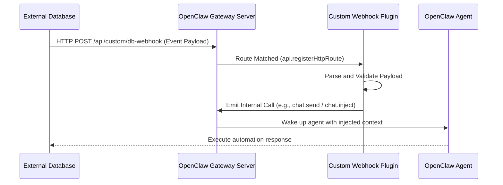

# OpenClaw Event-Driven Agent Triggers

## Problem
Traditional multi-agent systems, including the default OpenClaw setup, are entirely reactive. Agents sit idle in the background until a human user explicitly sends a message or invokes a command. However, in an advanced system utilizing external databases (such as PostgreSQL with our memory plugin), there is a strong need for proactive behavior. If a database row changes, an external system alert fires, or a GitHub webhook is received, the agent should automatically wake up, be provided with the context of the event, and execute a predefined workflow without human intervention.

## Insights
Based on a deep dive into the OpenClaw source code (specifically `src/plugins/types.ts`, `src/gateway/server.impl.ts`, and `src/plugins/hooks.ts`), the system is fundamentally a long-running, event-driven server. It acts as a "neurological hub" operating on three distinct event levels:

### 1. Internal Execution Events (Lifecycle Hooks)
Controlled via the `HookRunner` system, OpenClaw fires synchronous and asynchronous "hooks" (events) at specific execution points.
*   **`before_prompt_build`:** Fired right before the LLM creates a response (ideal for proactive context injection).
*   **`after_tool_call`:** Fired immediately after the agent runs a tool.
*   **`agent_end`:** Fired when the agent finishes its turn (ideal for background memory extraction).

### 2. The Internal Event Bus (Gateway Broadcasting)
OpenClaw uses a central Node.js `EventEmitter` and WebSocket publisher (using `broadcast` and `nodeSendToSession`). Whenever an agent streams a word, uses a tool, or finishes a thought, the Gateway emits an event. This allows connected UIs, chat bots (Discord/Telegram), and other subscribed agents to react instantly.

### 3. External Ingestion Events (Webhooks/Triggers)
Because OpenClaw is inherently an HTTP web server, the `OpenClawPluginApi` exposes a highly privileged capability called `registerHttpRoute`. This allows any loaded custom plugin to attach REST endpoints (like `POST /api/custom/db-webhook`) directly to the Gateway. Once the webhook is hit by an external system (e.g. Postgres trigger), the plugin can programmatically invoke an agent by emitting an internal event to the Gateway (e.g., `chat.send` or `chat.inject`) exactly as if it were a connected client.

## Method
To implement a proactive, event-driven architecture, we leverage the Gateway Server's HTTP routing capabilities:

1.  **Configure the External Trigger:** Set up the external system (e.g., a PostgreSQL trigger, a cron job script, or a third-party webhook) to send an HTTP POST request to a specific URL when an event occurs (e.g., `http://localhost:18789/api/custom/event-webhook`).
2.  **Define the Webhook Route:** Inside our custom OpenClaw Plugin, use `api.registerHttpRoute` to listen on `/api/custom/event-webhook`. We can secure this using OpenClaw's built-in Gateway API keys by setting `auth: "gateway"`.
3.  **Parse and Validate:** The plugin's route handler executes in the Node.js runtime, parsing the incoming JSON payload and authenticating the request.
4.  **Programmatic Agent Wake-up:** The handler constructs an initial prompt describing the event context (e.g., *"System Alert: Database status changed to VIP. Payload: { ... }. Please review and update the billing system."*). It then dispatches this payload to a designated agent ID using the system's programmatic invocation functions, instantly waking up the agent to perform the task.

### Visualization

## Result
By exposing a webhook through `registerHttpRoute`, OpenClaw transforms from a purely reactive chat assistant into an autonomous, event-driven worker. This architecture allows the system to instantly respond to real-time changes in external databases or services, drastically expanding the capabilities of the agents beyond traditional human-in-the-loop interactions and unlocking true proactive automation.
