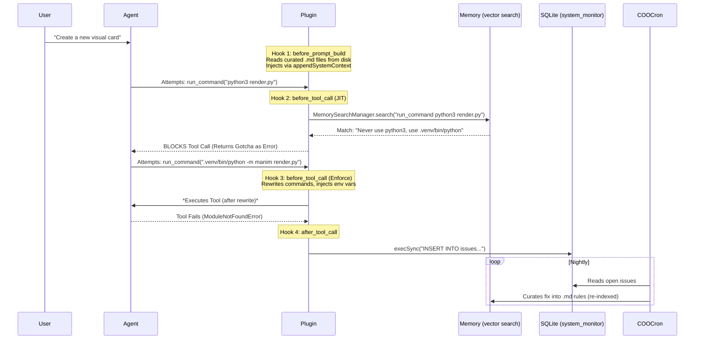

# Autonomous Knowledge Flywheel: JIT Interception & Self-Correction

*Created: 2026-03-19 | Status: Implemented*

---

## 1. Problem
Multi-agent systems struggle to reliably use accumulated knowledge without human-in-the-loop reminders. The previous iteration of the "Proactive Learning" plugin solved passive knowledge by injecting it, but introduced new architectural bottlenecks:

| Problem | Impact |
| :--- | :--- |
| **Context Decay** | `prependContext` injected rules into the middle of the prompt. As transcripts grew, LLMs suffered from "middle-of-prompt bias" and ignored the rules.
| **Token Inefficiency** | Injecting blocks into the transient conversation flow means providers cannot cache the instructions, costing tokens on every single turn. |
| **Low Knowledge Retrieval Usage** | Previously, `memory_search` was manual and prompt-based. Because it relied on LLM discretion rather than deterministic code, usage was extremely low, meaning accumulated knowledge (gotchas, fixes) sat idle and was rarely applied. |
| **No Autonomous Feedback** | When tools failed, the agent might retry, but the system itself didn't autonomously log exactly *what* failed for future curation. |

---

## 2. Insights

### 1. System Prompt Injection Trumps Conversational Injection
Injecting rules via `appendSystemContext` fuses the knowledge directly to the immutable System Prompt. Modern LLMs heavily prioritize the system block regardless of conversation length, completely eliminating context decay. Furthermore, this allows providers (Anthropic, Gemini, OpenAI) to **Cache the Prompt**, dropping per-turn token costs drastically.

### 2. Provenance Metadata ensures 100% Determinism
Rather than hoping the LLM correctly interprets when it has received a `session_send` task, we leverage OpenClaw's hidden message metadata (`provenance: { sourceTool: 'sessions_send' }`) to definitively trigger the workflow injection without altering the user's raw text.

### 3. Per-Domain Agent Targeting
Injection targeting moved from a global `targetAgents` gate to **per-domain** `targetAgents`. Each domain config can specify which agents it applies to (e.g. `yt_*` domains target `["youtube"]` only), or omit `targetAgents` to apply to all agents (e.g. `session_send` protocol). This eliminates the all-or-nothing constraint of v2.

### 4. Automated Interception > Manual Search
The core problem was that agents forgot to run `memory_search`. We *must* automate it so knowledge is always checked. However, automating it on every chat turn (`before_prompt_build`) adds a ~250ms embedding/search penalty to every single message.
Moving the automated semantic search to the execution phase (`before_tool_call`) solves both problems perfectly:
- **0-Latency Chat:** The agent thinks and chats with zero overhead.
- **High-Precision Automation:** When it actually attempts an action (e.g., `run_command("python3 render.py")`), the plugin intercepts the tool, searches all indexed memory using the *highly specific* tool parameters, and autonomously **blocks** the action if a safety gotcha is found. No LLM decision required to search.

### 5. Plugins can drive Asynchronous Feedback Loops
Because the plugin runs within the Node.js OpenClaw process, it can use native subshells (`child_process.execSync`) during the `after_tool_call` hook to instantly inject failures into the external `system_monitor.db` SQLite database, feeding the COO cron directly.

---

## 3. Method

### Architecture Diagram

### Technical Implementation

#### 1. System Prompt Caching
Return `{ appendSystemContext }` instead of `{ prependContext }` from `before_prompt_build`. Rules fuse into the system prompt block, enabling provider prompt caching.

#### 2. Per-Domain Injection with Provenance
- Keyword-based domains (e.g. `yt_*`) use `targetAgents: ["youtube"]` — only injected for matching agents.
- Provenance-based domains (e.g. `session_send`) check `message.provenance.sourceTool === "sessions_send"` on recent messages — deterministic, no keyword guessing, applies to all agents.

#### 3. JIT `before_tool_call` Interception (Hook 2, priority 10)
- Import `getMemorySearchManager` from `src/memory/search-manager.js`.
- Lazily initialize `MemorySearchManager` on first tool call (cached for gateway lifecycle).
- Build query from `toolName` + `JSON.stringify(params)` (truncated to ~200 chars).
- Call `manager.search(query, { maxResults: 3, minScore: 0.8 })` — searches all indexed memory (conversations, files, shared_learnings).
- If high confidence match: return `{ block: true, blockReason: "Gotcha found: [snippet]" }`.
- Fail-open: errors are logged but never block tool calls.

#### 4. Mechanical Enforcement (Hook 3, default priority)
- Rewrites commands (e.g. `python3 -m manim` to `.venv/bin/python -m manim`).
- Injects environment variables (e.g. `DISPLAY=:0`).
- Per-agent rules keyed by `agentId`.

#### 5. Asynchronous `after_tool_call` Logging (Hook 4)
- Check `event.error` — no-op on success.
- Execute: `execSync("sqlite3 ~/Documents/mission-control/data/system_monitor.db 'INSERT INTO issues...'")`
- Fire-and-forget: failures are logged to debug log, never thrown.

---

## 4. Result

The final implementation yields a **Zero-Latency, Self-Correcting Flywheel**:
1. **$0 / 0ms Overhead:** Normal chat interactions are completely unaffected by search latency.
2. **Infinite Memory Retention:** Cached System Prompts ensure rules are never forgotten mid-session.
3. **True Autonomy:** The system physically blocks its own mistakes based on past learnings, and automatically generates dashboard tickets for any new failures it encounters.
4. **Deterministic Workflow Injection:** Provenance metadata triggers protocol injection with zero false positives — no keyword guessing required.
